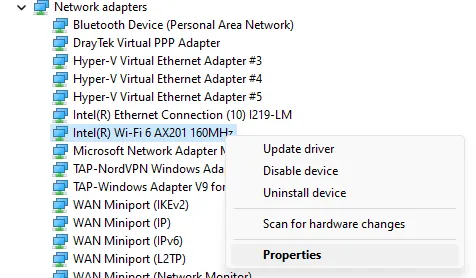
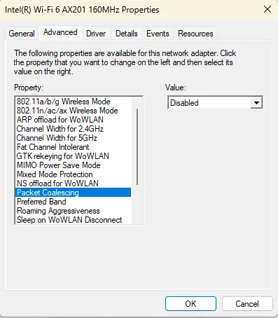

# Slow Wireless Uploads On Lenovo T14 Gen1 Laptops

This article provides a solution to poor upload speeds of around 1Mbps on Lenovo T14 Gen1 laptops with an Intel AX201 wireless card.

## Symptoms

- Upload speeds are very slow both in speed tests and real world applications
  - Often this might show as issues with video calling etc.
- Download speeds are fine
  - Often several hundred Mbps to LAN targets
- Affects both 2.4GHz and 5GHz networks
- Affects Windows and Linux
  - I have personally experienced this on Windows 10 and 11, however I have seen many reports online relating to Linux too, primarily Ubuntu

## Solution

### Windows 10 or 11

1. Ensure that the latest drivers from Windows Update, Lenovo Vantage or Intel are installed
2. Open **Device Manager**
   1. `Win + X` >
   2. `Device Manager`
3. Expand **Network Adapters**
4. Right click on **Intel(R) Wi-Fi 6 AX201 160MHz**
5. Click on **Properties**

6. Click on the **Advanced** tab
7. Find **Packet Coalescing** in the **Property** list
8. Set the **Value** to **Disabled**

9.  Click **OK**
10. Close **Device Manager**
11. Retest
    - No reboot required

## Useful links and references

- Credit for the solution to **Illustrious_Head9069** on [reddit](https://www.reddit.com/r/thinkpad/comments/jtsyz7/comment/gihyti1/?utm_source=share&utm_medium=web2x&context=3)
- Lenovo System Update: <https://support.lenovo.com/gb/en/downloads/ds012808-lenovo-system-update-for-windows-10-7-32-bit-64-bit-desktop-notebook-workstation>