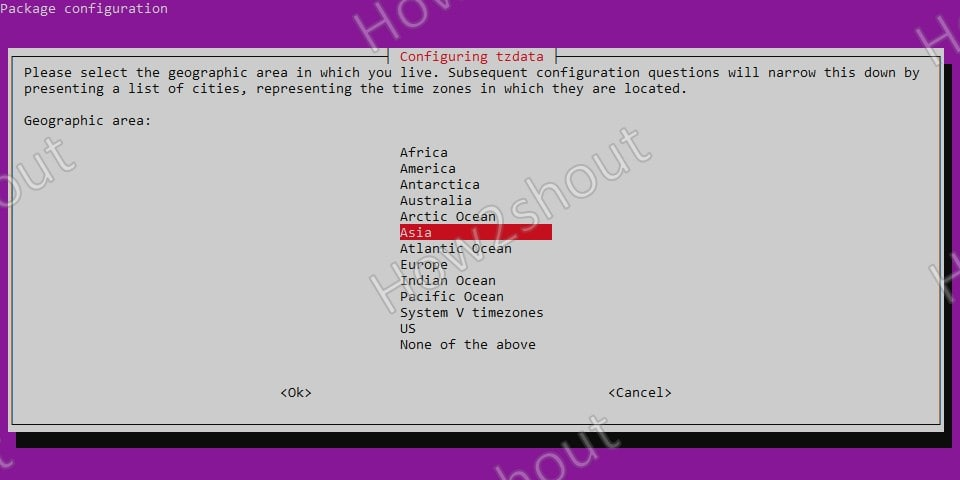
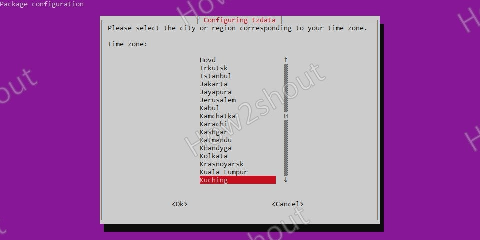

# Time Zone Management

Time zones can often be an issue when working with with multi-national organisations.  Often systems can be left in a default region such as US/Pacific which may not be the most appropriate if you systems are not located there.  Knowing how to set the timezone for a system can help administration teams.

## Ubuntu Server 20.04

1. Run command

        sudo dpkg-reconfigure tzdata

1. Select continent

    

1. Select city

    

Taken from: <https://www.how2shout.com/linux/command-to-change-timezone-in-ubuntu-20-04-server/>
