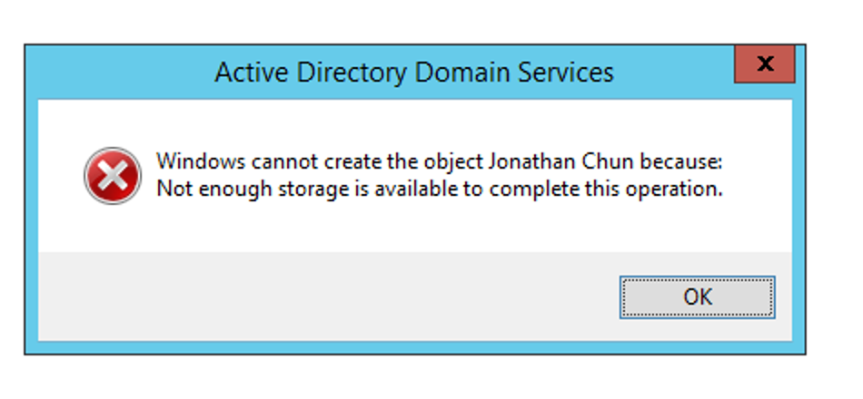

# Active Directory Create Entity Storage Error

## Environment

- Windows Server 2012 R2
- Active Directory Users and Computers
- Single Domain Controller (DC) domain

## Symptoms

Trying to create a new Active Directory Domain Services (AD DS) object such as a new user results in an error

```bash
Windows cannot create the object <object name> because: Not enough storage is available to complete this operation
```



## Resolution

This error actually has nothing to do with physical disk storage, or even memory.  The issue relates to the `IRPStackSize`.

Technically the IRPStackSize relates to the *remote machine* although this may also be a remote connection to the local machine in the case of a single DC domain.

1. Open `regedit`
1. Navigate to `HKEY_LOCAL_MACHINE\SYSTEM\CurrentControlSet\Services\LanmanServer\Parameters`
1. Modify the `IRPStackSize` parameter
  - If this parameter is missing create a **DWORD** value for it
  - Minimum value is **decimal 15**
  - Maximum value is **decimal 50**
  - Microsoft does not recommend values between and including **33* and **38**
  - Example: originally no value was set (default 15) when the error was experience, setting IRPStackSize to decimal 21 resolved the issue
4. Save changes
1. Reboot machine

## References

- <https://www.ghacks.net/2008/01/13/not-enough-server-storage-is-available-to-process-this-command/>
- <https://www.quadricsoftware.com/knowledge-base/irpstacksize-is-too-small/>
- <https://docs.microsoft.com/en-GB/troubleshoot/windows-server/backup-and-storage/not-enough-storage-process-this-command>
