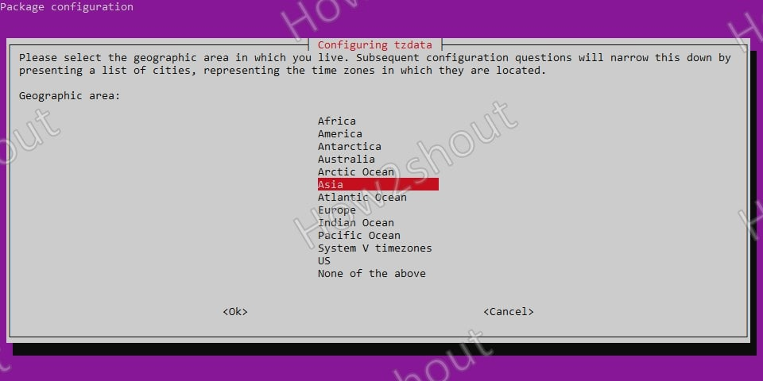
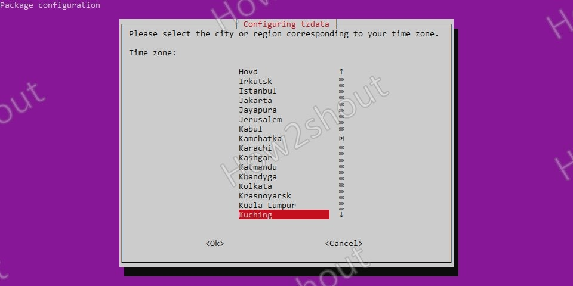

# Time Zone Management

## Contents

1. [Ubuntu Server 20.04](#ubuntu-server)

## Ubuntu Server 20.04

1. Run command

        sudo dpkg-reconfigure tzdata

1. Select continent

    

1. Select city

    
